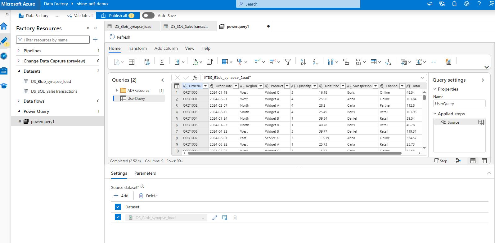
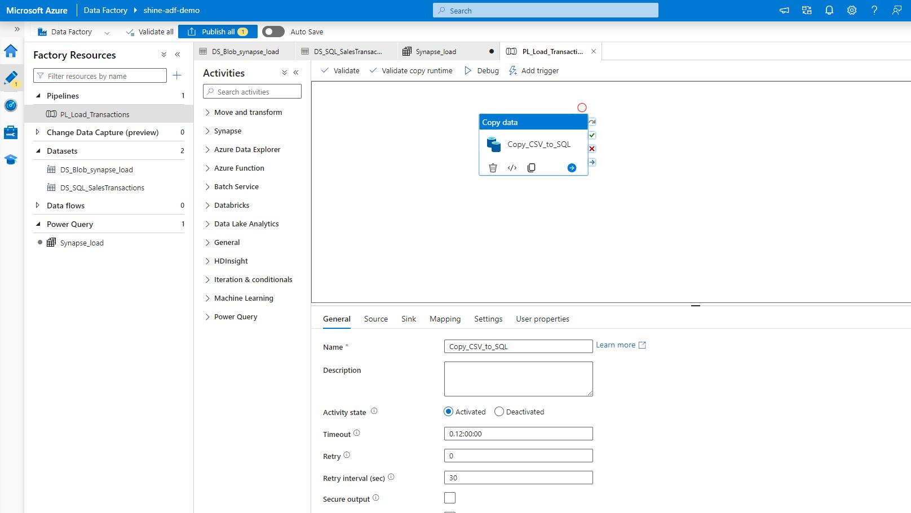
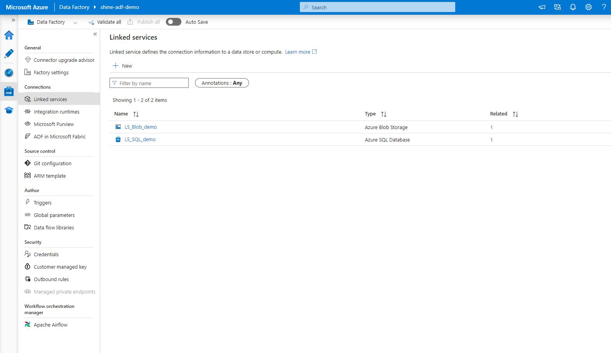
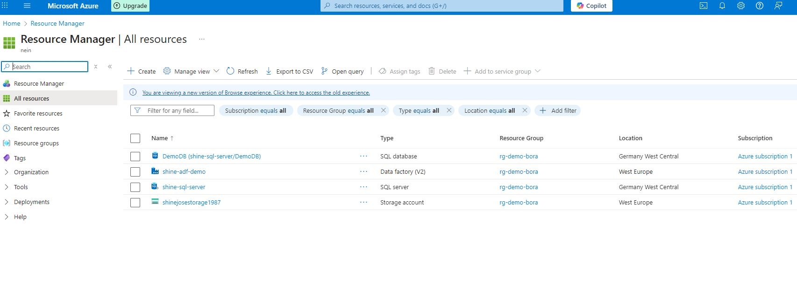

# Demo Project: End-to-End Analytics — Local ETL → Azure Blob → Azure SQL → ADF → Power BI

**Purpose:**
This repository is a hands-on demo that shows a minimal, reproducible analytics workflow: starting from raw transactional CSV data, performing local ETL to create KPI tables, moving data to Azure (Blob Storage → Azure SQL) using Azure Data Factory (ADF), and building a Power BI dashboard for stakeholders. It is designed for learning and for quickly creating a portfolio demo you can reference in job applications.

---

##  High-level summary — What this program and repo do (from the beginning)

1. **Sample data** (`data_sample_sales.csv`) contains synthetic transactional sales rows (OrderID, OrderDate, Product, Quantity, UnitPrice, Region, Salesperson, Channel).
2. **Local ETL script (`etl.py`)**:
   - Reads the raw transactional CSV,
   - Cleans and types the data,
   - Computes `Total = Quantity * UnitPrice`,
   - Aggregates daily KPIs (TotalSales, UnitsSold, AvgOrderValue),
   - Creates a 7-day rolling average used as a simple baseline forecast,
   - Saves two outputs:
     - `transformed_daily_kpis.csv` — ready-for-BI KPI table
     - `synapse_load.csv` — full transaction rows for loading into Azure SQL
3. **Azure staging & ingestion (recommended flow)**:
   - Upload `synapse_load.csv` to an Azure Blob container.
   - Use **Azure Data Factory (ADF)** to copy from Blob → Azure SQL Database (or Synapse).
   - The repository includes ADF pipeline JSON templates and Linked Service placeholders to speed up import into ADF.
4. **Database**:
   - Use `create_table.sql` to create `dbo.SalesTransactions` and `dbo.DailyKPIs` in Azure SQL.
   - ADF writes transactional rows into `dbo.SalesTransactions`.
   - You may optionally run an SQL job or stored procedure to populate `dbo.DailyKPIs` from `SalesTransactions`, or use the locally produced `transformed_daily_kpis.csv` directly for Power BI.
5. **Power BI**:
   - Import `transformed_daily_kpis.csv` (fast) or connect directly to Azure SQL (production-like).
   - Transform data (Power Query), create dimension tables (Products, Regions, Salesperson, Channel, Date), build relationships (star schema), add DAX measures, and create report pages (Overview, Sales by Region/Product, Transactions, Forecast & Anomalies).
6. **Outcome**: a reusable analytical pipeline and a report illustrating KPI-tracking, trends, forecasts and anomaly detection suitable for stakeholder demos and interviews.

---

##  Why use this program and why integrate Azure?

- **Reproducibility**: ETL script standardizes cleaning and KPI generation. Anyone with the repo can reproduce the same KPIs.
- **Scalability**: Azure Blob + SQL + ADF lets you move from local CSVs to cloud storage, schedule recurring loads, and handle large volumes.
- **Automation**: ADF provides scheduling, monitoring and retry logic. Instead of manual uploads, pipelines run automatically.
- **Separation of concerns**: ETL, storage, transformation and visualization live in their respective layers (modular architecture).
- **Governance & Security**: Cloud storage + SQL provide central data access control and integration with Azure AD/Key Vault for credentials.
- **Portfolio & hiring advantage**: Demonstrates cloud workflows (storage, ADF, SQL) plus BI visualization — highly relevant for BI & Data Analyst roles.

---

##  Quick-start (local only)

1. Ensure Python 3.8+ and pip are installed.
2. Extract the repository ZIP (or clone your GitHub repo with these files).
3. Open a terminal in the folder and create virtualenv:
   ```bash
   python -m venv venv
   # Activate (Windows PowerShell)
   .\venv\Scripts\Activate.ps1
   pip install -r requirements.txt
   ```
4. Run ETL:
   ```bash
   python etl.py
   ```
5. Files produced: `transformed_daily_kpis.csv`, `synapse_load.csv`.
6. Open Power BI Desktop → Get Data → Text/CSV → import `transformed_daily_kpis.csv` and follow `powerbi_page_mockups.md` to assemble the report.

---

##  Architecture & flow (summary)

- Local ETL produces KPIs and full transactions.
- Blob holds raw transactions for ingestion.
- ADF copies from Blob to Azure SQL.
- Power BI connects to either local KPIs or Azure SQL for reporting.

ASCII diagram:
```
[Local ETL: etl.py] --(transformed_daily_kpis.csv)--> [Power BI Desktop]
        |
        +--(synapse_load.csv)--> [Azure Blob Storage] --(ADF Copy)--> [Azure SQL Database]
                                                                    |
                                                                    --> [Power BI Desktop / Service]
```

---

## Screenshots

Outputs

<p align="center"></p>
<p align="center"></p>
<p align="center"></p>
<p align="center"></p>
<p align="center"></p>

##  Next steps & improvements
- Add Key Vault integration, managed identities, incremental loads, CI/CD for ADF, and scheduled refresh in Power BI Service.

---

**Author:** Shine Jose
**License:** MIT (see LICENSE file)
